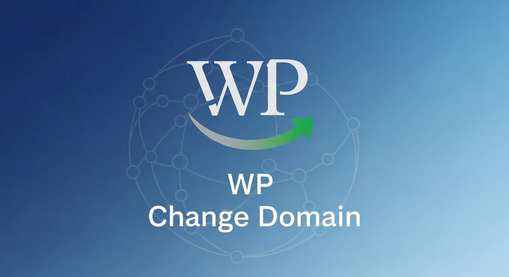

# WP Change Domain 🚀

Readme: [BR](README-ptbr.md)




This Shell Bash script was developed to automate the process of changing the domain in `WordPress` installations. It performs search and replace directly in the MySQL/MariaDB database, ensuring that all references to the old domain are updated to the new one.

## 📝 Description

When moving a WordPress site to a new domain, it is not enough to just change the files. It is necessary to update several entries in the database, including post URLs, image links, and global settings. This script simplifies this process by executing SQL commands safely and quickly via terminal.

## ✨ Features

- **Options Update**: Changes siteurl and home in the `wp_options` table.
- **Global Search and Replace**: Updates URLs in posts, pages, comments, and metadata.
- **Cache Cleanup (Optional)**: Helps avoid conflicts after migration.
- **Simplicity**: Interactive terminal interface that requests the necessary data.

## 📋 Prerequisites

Before using the script, make sure the environment meets the following requirements:

- Linux/Unix Operating System.
- Terminal access (SSH).
- MySQL/MariaDB client installed.
- **Up-to-date database backup** (mandatory for safety).

## 🚀 Installation and Usage

1. **Download the file to the server:**

```bash
curl -O https://raw.githubusercontent.com/sr00t3d/wpchangedomain/refs/heads/main/wpchange_domain.sh
```

2. **Grant execution permission:**

```bash
chmod +x wpchange_domain.sh
```

3. **Run the script:**

```bash
./wpchange_domain.sh

Example:

```bash
./wpchange_domain.sh 
[!] Starting...
[+] File wp-config.php was found.
[+] Database values found:
------------------------
| Database: sql_wpdomain_com
| User:     sql_wpdomain_com
| Host:     localhost
------------------------
[!] Checking the current domain...
[!] Trying to establish a connection, please wait...
[+] The actual database domain for: http://wpdomain.com (Prefix: wp_8b7fba_)
[!] Dumping database, please wait...
[+] Database dump created at: /www/wwwroot/wpdomain.com/backup_sql_wpdomain_com_20260228_001024.sql

Insert the NEW domain (e.g., domain.com.br): wpnewdomain.com

[!] This script will change wpdomain.com to wpnewdomain.com
Do you want to continue? (y/n): y

[!] Continuing...
[+] Changing database domain...

mysql: [Warning] Using a password on the command line interface can be insecure.

[+] All values were updated successfully.
```
## Usage

```bash
./wpchange_domain.sh [-s|--skip] [-n|--noversion]
```
- `--noversion` Skip version checking on remote source.
- `--skip` Skip database backup creation.
- `--help` Display help message.

## ⚠️ Important Warnings

- **Backup**: **Never run scripts that modify the database without having a full backup**. If something goes wrong, you will be able to restore your site.
- **Serialized Data**: Note that direct replacements via SQL can corrupt PHP serialized data (common in some page builder plugins like Elementor). After running the script, it is recommended to review the site.
- **Permissions**: Make sure to run the script with a user that has read/write permissions on the database.

## ⚠️ Legal Notice

> [!WARNING]
> This software is provided "as is". Always ensure you have explicit permission before running. The author is not responsible for any misuse, legal consequences, or data impact caused by this tool.

## 📚 Detailed Tutorial

For a complete, step-by-step guide, check out my full article:

👉 [**Change WordPress Domain in Shell**](https://perciocastelo.com.br/blog/change-wordpress-domain-in-shell.html)

## License 📄

This project is licensed under the **GNU General Public License v3.0**. See the [LICENSE](LICENSE) file for more details.
